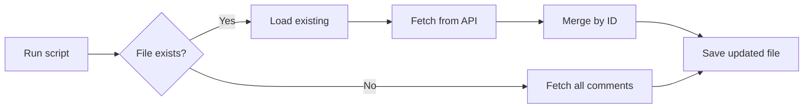

# PR Comment Grabber Script

## Overview

`pr-comment-grabber.py` extracts **ALL** comments from a GitHub Pull Request, including both review comments (inline code comments) and issue comments (general PR conversation).

## Quick Start

```bash
cd /path/to/your/repo
python pr-comment-grabber.py owner/repo PR_NUMBER
```

## Prerequisites

### Install Dependencies
```bash
pip install requests
```

### GitHub Token

Set your GitHub Personal Access Token:

```bash
# Option 1: Environment variable
export GITHUB_TOKEN=ghp_your_token_here

# Option 2: From 1Password
export GITHUB_TOKEN=$(op item get "GitHub" --fields label="Personal Access Token")

# Option 3: Pass directly
python pr-comment-grabber.py owner/repo 123 --token ghp_xxxxx
```

**Token Requirements:**
- Scope: `repo` (private repos) or `public_repo` (public repos)
- Generate at: https://github.com/settings/tokens

## Usage

### Basic Usage

**IMPORTANT: Run from your repository root, not from the scripts directory**

```bash
cd ~/Desktop/projects/my-app
python /path/to/pr-comment-grabber.py myorg/my-app 42
# Saves to: ./pr-code-review-comments/pr42-code-review-comments.json
```

### Incremental Updates

Re-run the same command to fetch new comments without creating duplicates:

```bash
python pr-comment-grabber.py myorg/my-app 42
# Output:
#   Loaded 27 existing comments
#   New comments added: 3
#   Comments updated: 1
#   Total after merge: 30
```

### Batch Processing

```bash
# Process multiple PRs
for pr in 42 43 44 45; do
  python pr-comment-grabber.py owner/repo $pr
done
```

## Output Format

Creates `pr-code-review-comments/pr{NUMBER}-code-review-comments.json` with TWO types of comments:

### Review Comment (Inline Code Comment)
```json
{
  "comment_type": "review",
  "id": 123456789,
  "user": "reviewer-username",
  "body": "Consider refactoring this function",
  "path": "src/utils/helper.py",
  "line": 42,
  "position": 15,
  "diff_hunk": "@@ -40,6 +40,8 @@ ...",
  "created_at": "2025-01-15T14:30:00Z",
  "html_url": "https://github.com/owner/repo/pull/42#discussion_r123456789"
}
```

### Issue Comment (General PR Conversation)
```json
{
  "comment_type": "issue",
  "id": 987654321,
  "user": "qodo-merge",
  "body": "## PR Analysis Summary\n\nOverall: Good",
  "created_at": "2025-01-15T12:00:00Z",
  "html_url": "https://github.com/owner/repo/pull/42#issuecomment-987654321",
  "path": null,
  "line": null
}
```

## Features

- ✅ **Full pagination**: Fetches ALL comments (handles 100+ comments)
- ✅ **Two comment types**: Review (inline) + Issue (general conversation)
- ✅ **Incremental updates**: Merge new comments without duplicates
- ✅ **Deduplication**: Uses comment IDs to prevent duplicates
- ✅ **Complete metadata**: 16+ fields per comment (path, line, diff, timestamps)
- ✅ **Error handling**: Clear messages for auth failures, 404s, network errors
- ✅ **Progress logging**: Shows fetch progress on stderr
- ✅ **Relative paths**: Saves in current working directory

## Troubleshooting

### Authentication Failed (401)
```
ERROR: HTTP 401 - Unauthorized
Authentication failed. Check your GITHUB_TOKEN.
```

**Fix:**
- Verify token: `echo $GITHUB_TOKEN`
- Check token scope includes `repo` or `public_repo`
- Regenerate token if expired: https://github.com/settings/tokens

### PR Not Found (404)
```
ERROR: HTTP 404 - Not Found
Resource not found. Check repository and PR number.
```

**Fix:**
- Verify repo format: `owner/repo` (no spaces, no `.git`)
- Confirm PR number is correct
- Check you have access to the repository

### Requests Library Not Found
```
ERROR: requests library not found. Install with: pip install requests
```

**Fix:**
```bash
pip install requests
```

### Wrong Directory Error

**Symptom:** Script runs but creates `pr-code-review-comments/` in unexpected location

**Fix:** Always `cd` to your repository root before running:
```bash
cd ~/Desktop/projects/my-app  # Navigate first
python /path/to/pr-comment-grabber.py owner/repo 42
```

## Advanced Usage

### Filter Comments by Type

```bash
# Extract only review comments (inline)
jq '[.[] | select(.comment_type == "review")]' pr42-code-review-comments.json

# Extract only issue comments (general)
jq '[.[] | select(.comment_type == "issue")]' pr42-code-review-comments.json
```

### Filter by Reviewer

```bash
# Comments from specific user
jq '[.[] | select(.user == "alice-reviewer")]' pr42-code-review-comments.json
```

### Filter by Date

```bash
# Comments after specific date
jq '[.[] | select(.created_at > "2025-01-20")]' pr42-code-review-comments.json
```

### Count Comments

```bash
# Total comments
jq 'length' pr42-code-review-comments.json

# Review comments only
jq '[.[] | select(.comment_type == "review")] | length' pr42-code-review-comments.json
```

## Integration Examples

### Git Hook (Pre-Push)

```bash
# .git/hooks/pre-push
#!/bin/bash

# Fetch latest PR comments before pushing
PR_NUM=$(gh pr view --json number --jq .number 2>/dev/null)
if [ -n "$PR_NUM" ]; then
  python scripts/pr-comment-grabber.py $(gh repo view --json nameWithOwner --jq .nameWithOwner) $PR_NUM
fi
```

### CI/CD Workflow

```yaml
# .github/workflows/pr-comments.yml
name: Extract PR Comments

on: pull_request_review

jobs:
  extract:
    runs-on: ubuntu-latest
    steps:
      - uses: actions/checkout@v2
      - name: Extract comments
        run: |
          python scripts/pr-comment-grabber.py \
            ${{ github.repository }} \
            ${{ github.event.pull_request.number }}
        env:
          GITHUB_TOKEN: ${{ secrets.GITHUB_TOKEN }}
      - uses: actions/upload-artifact@v2
        with:
          name: pr-comments
          path: pr-code-review-comments/
```

## How It Works

### Pagination Handling

The script automatically follows GitHub's pagination links to fetch ALL comments:

```python
# Fetches 100 comments per page
# Follows 'next' links until no more pages
# Example: PR with 250 comments = 3 API requests
```

### Incremental Updates



### Deduplication Strategy

- Comments are keyed by `id` (unique GitHub comment ID)
- If comment exists: Update with newer data (handles edits)
- If comment new: Add to collection
- Result: No duplicates, always latest version

## Version

- **Script Version**: 2.0
- **API Version**: GitHub REST API v3
- **Python**: 3.6+
- **Dependencies**: `requests`

## Next Steps

After extracting comments, see the main SKILL.md for analysis instructions using the LLM analysis prompt.
