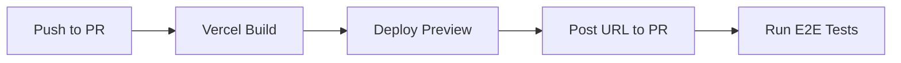
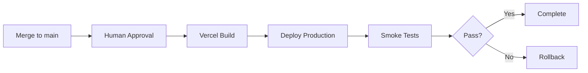

# Deploy Strategy Skill

## Purpose
Manage reliable, zero-downtime deployments with proper environment isolation and rollback capabilities.

## Platform
- **Hosting**: Vercel
- **Preview Deploys**: Automatic per PR
- **Production**: Manual approval required

## Environment Strategy

### Environments
| Environment | Branch | URL Pattern | Purpose |
|-------------|--------|-------------|---------|
| Preview | PR branches | `*.vercel.app` | PR review |
| Staging | `develop` | `staging.domain.com` | Integration testing |
| Production | `main` | `domain.com` | Live users |

### Environment Variables
```
# .env.example - Template for all environments
DATABASE_URL=
BETTER_AUTH_SECRET=
BETTER_AUTH_URL=

# Environment-specific (set in Vercel dashboard)
NEXT_PUBLIC_ENV=preview|staging|production
NEXT_PUBLIC_APP_URL=
```

## Vercel Configuration

### vercel.json
```json
{
  "buildCommand": "bun run build",
  "devCommand": "bun run dev",
  "installCommand": "bun install",
  "framework": "nextjs",
  "regions": ["iad1"],
  "headers": [
    {
      "source": "/api/(.*)",
      "headers": [
        { "key": "Cache-Control", "value": "no-store" }
      ]
    }
  ],
  "rewrites": [
    { "source": "/health", "destination": "/api/health" }
  ]
}
```

### Build Settings
- **Build Command**: `bun run build`
- **Output Directory**: `.next`
- **Install Command**: `bun install`
- **Node Version**: 20.x

## Deployment Workflow

### Preview Deploy (Automatic)


### Production Deploy (Manual)


## Pre-Deploy Checklist
- [ ] All tests passing in CI
- [ ] No TypeScript errors
- [ ] No lint errors
- [ ] Build succeeds locally
- [ ] Environment variables verified
- [ ] Database migrations applied

## Deploy Commands

### Preview
```bash
bunx vercel
```

### Staging
```bash
bunx vercel --env NEXT_PUBLIC_ENV=staging
```

### Production
```bash
bunx vercel --prod
```

## Rollback Procedures

### Instant Rollback (Vercel Dashboard)
1. Go to Vercel Dashboard → Deployments
2. Find last known good deployment
3. Click "..." → "Promote to Production"
4. Verify rollback success

### CLI Rollback
```bash
# List recent deployments
bunx vercel ls

# Promote specific deployment
bunx vercel promote [deployment-url]
```

### Database Rollback
If deployment included migrations:
```bash
bun drizzle-kit rollback
```

## Monitoring Post-Deploy

### Health Check
```bash
curl -f https://domain.com/api/health || echo "FAILED"
```

### Smoke Tests
```bash
bun test:e2e:smoke
```

### Error Monitoring
Check Sentry for new errors in the release:
```bash
# Sentry release tracking is automatic via Vercel integration
```

## Troubleshooting

### Build Failures
1. Check build logs in Vercel dashboard
2. Verify environment variables are set
3. Check for missing dependencies
4. Ensure Node version matches

### Runtime Errors
1. Check Vercel function logs
2. Review Sentry error reports
3. Verify database connectivity
4. Check API endpoint health

### Performance Issues
1. Review Vercel Analytics
2. Check Core Web Vitals
3. Analyze bundle size
4. Review API response times

## Output Format
```markdown
## Deployment: [Environment]

### Status
- **URL**: [deployment-url]
- **Commit**: [sha] - [message]
- **Duration**: Xm Xs
- **Status**: Success | Failed | Rolled Back

### Verification
- [ ] Health check passed
- [ ] Smoke tests passed
- [ ] No new Sentry errors

### Issues
[Any issues encountered]

### Rollback Status
Not needed | Completed | In Progress
```
