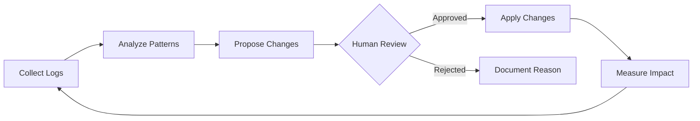

# Learning Extractor

## Purpose
Enable the Claude Code configuration to evolve based on actual usage patterns, implementing a feedback loop where the system improves itself over time.

## Philosophy
From Viktor Bezdek: "Configuration evolves based on actual usage. Skills that rarely activate get flagged for review. Common failure patterns get addressed. The key is human oversight. Claude suggests; humans decide."

## Data Collection

### Session Logging
Each session generates a log entry in `.claude/logs/sessions/`:
```json
{
  "timestamp": "2025-01-19T10:00:00Z",
  "duration_seconds": 300,
  "task_type": "implementation",
  "skills_activated": ["code-standards", "testing-patterns"],
  "commands_used": ["/implement"],
  "token_usage": {
    "input": 15000,
    "output": 8000
  },
  "outcome": "success",
  "rework_required": false,
  "errors_encountered": [],
  "files_modified": ["src/lib/utils.ts", "tests/unit/utils.test.ts"]
}
```

### Metrics Tracked
| Metric | Description | Target |
|--------|-------------|--------|
| First-pass accuracy | Tasks completed without rework | > 80% |
| Token efficiency | Tokens per successful task | Decreasing |
| Skill activation rate | % of skills used regularly | > 50% |
| Error rate | Errors per session | < 5% |
| Coverage maintenance | Test coverage trend | ≥ 80% |

## Analysis Patterns

### Skill Analysis
```markdown
## Skill Health Report

### High Usage (Good)
- code-standards: 89% of sessions
- testing-patterns: 76% of sessions

### Low Usage (Review Needed)
- incident-response: 2% of sessions
  - Reason: Rarely needed, or description unclear?
  
### Never Used
- [skill-name]: 0% of sessions
  - Action: Review description, consider removal
```

### Pattern Detection
```markdown
## Common Patterns Detected

### Repeated Clarifications
Users frequently ask: "How do I format X?"
→ Add to code-standards skill

### Error Patterns
Common error: "Missing environment variable"
→ Add pre-flight check to implement command

### Rework Triggers
Frequent rework after: Database changes
→ Enhance db-migrations skill with more examples
```

## Improvement Categories

### 1. Context Optimization
**Goal**: Reduce noise, improve signal

Actions:
- Trim unused CLAUDE.md sections
- Promote frequently-accessed @imports to root
- Remove outdated documentation references

### 2. Skill Enhancement
**Goal**: Improve first-pass accuracy

Actions:
- Add examples from successful tasks
- Include common clarifications
- Add checklist items for missed steps

### 3. Command Refinement
**Goal**: Streamline workflows

Actions:
- Create composite commands for common sequences
- Add missing pre-flight checks
- Improve output templates

### 4. Hook Tuning
**Goal**: Balance automation with speed

Actions:
- Remove slow or rarely-triggered hooks
- Add missing guards for common errors
- Tune matcher patterns

## Improvement Process

### 1. Collect (Automatic)
Session logs accumulate in `.claude/logs/sessions/`

### 2. Analyze (Weekly)
```bash
/optimize all
```

### 3. Propose
Generate specific file changes with rationale:
```markdown
## Proposed Change: Enhance code-standards skill

### File: .claude/skills/code-standards/SKILL.md

### Change
Add section on error handling patterns

### Rationale
- 23% of rework was due to inconsistent error handling
- Users asked for clarification 15 times this week

### Expected Impact
- Reduce error-handling related rework by 50%
- Improve first-pass accuracy by 5%
```

### 4. Review (Human)
Human reviews and approves/rejects proposals

### 5. Apply
Approved changes are applied

### 6. Measure
Track metrics post-change to verify improvement

## Auto-Apply Rules

These changes can be applied without human approval:
- Log file cleanup
- Documentation typo fixes
- Metric collection improvements
- Non-destructive CLAUDE.md additions

## Requires Approval

These changes need human review:
- Skill file modifications
- Command changes
- settings.json updates
- Hook modifications
- Any deletions

## Change Log

Maintain `.claude/logs/changes.md`:
```markdown
# Configuration Change Log

## 2025-01-19

### code-standards skill
- Added: Error handling patterns section
- Reason: High rework rate on error handling
- Impact: Pending measurement

### /implement command
- Added: Pre-flight check for test coverage
- Reason: Frequent coverage regression
- Impact: Coverage maintained at 85%+
```

## Output Format
```markdown
## Self-Improvement Report

### Analysis Period
[Date range] | [Session count] analyzed

### Key Metrics
| Metric | Previous | Current | Trend |
|--------|----------|---------|-------|
| First-pass accuracy | X% | Y% | ↑/↓ |
| Avg tokens/task | X | Y | ↑/↓ |
| Error rate | X% | Y% | ↑/↓ |

### Top Opportunities
1. **[Area]**: [Finding]
   - Evidence: [Data]
   - Proposed action: [Change]
   - Expected impact: [Estimate]

### Proposed Changes
| File | Change | Status |
|------|--------|--------|
| [path] | [description] | Pending Approval |

### Auto-Applied
- [Change 1]
- [Change 2]

### Next Review
[Scheduled date]
```

## Continuous Improvement Cycle

