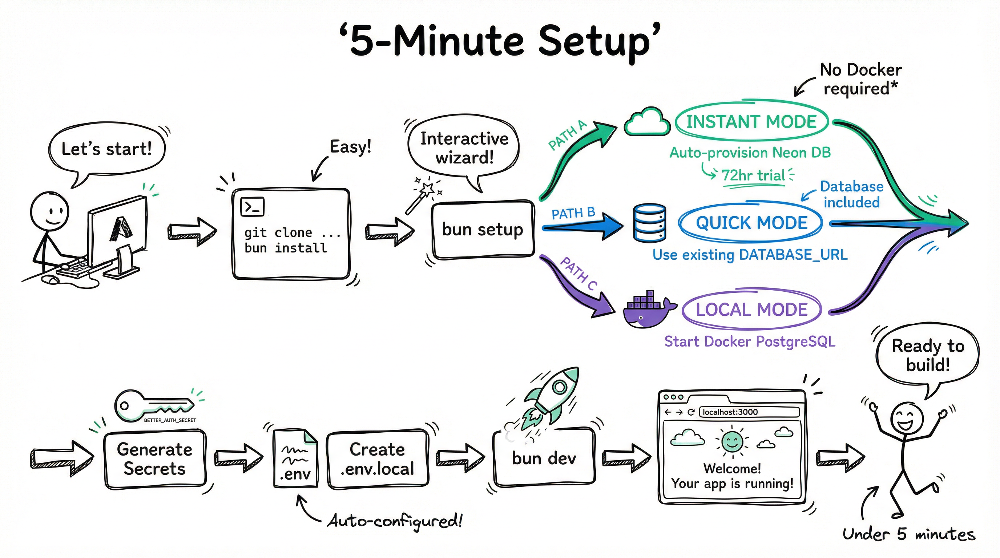
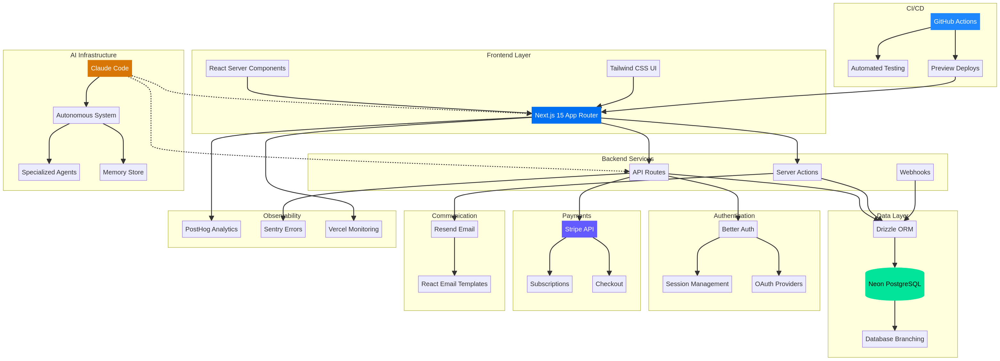
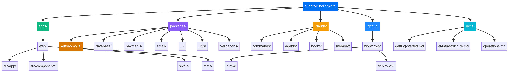
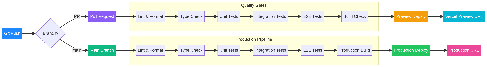

# AI-Native Boilerplate


A production-ready Next.js 15 template built for autonomous AI-assisted development. Ship faster with Claude Code integration, self-improving workflows, and battle-tested infrastructure.

[](https://github.com/viktorbezdek/ai-native-boilerplate/actions/workflows/ci.yml)
[](https://opensource.org/licenses/MIT)

## Why This Exists

Building production applications requires weeks of boilerplate setup—auth, payments, database, testing, CI/CD, monitoring. Adding AI assistance means more configuration. Most developers spend more time on infrastructure than product. This boilerplate is the solution: a complete, working application with AI-native development baked in. Clone, configure, and start building features in under 5 minutes. Claude Code understands the codebase and can autonomously handle routine tasks.

## Features


## Technology Stack

This boilerplate comes with a comprehensive, modern technology stack to cover all your development needs.


## Quick Start

Get up and running in minutes with our interactive setup wizard.



```bash
# Clone and install
git clone https://github.com/yourusername/ai-native-boilerplate.git
cd ai-native-boilerplate
bun install

# Interactive setup (creates instant database, generates secrets)
bun setup

# Start development
bun dev
```

Open [http://localhost:3000](http://localhost:3000). The app is running with a working database. **That's it.** No manual env configuration. No Docker required. Database provisioned automatically.

> For production use, create a permanent database at [neon.tech](https://neon.tech) (free tier available).

## Architecture

The project is structured as a monorepo with a clear separation of concerns.



## Project Structure



## AI-Native Development

This boilerplate is designed for development with Claude Code. The AI understands the codebase structure, conventions, and can perform autonomous tasks.

### Autonomous System

The `@repo/autonomous` package implements a self-improving development loop:


- **Confidence Engine**: Scores range from 0-100. Actions above 95 auto-execute, 80-95 notify, below 60 escalate.
- **Signal Processor**: Gathers data from Sentry errors, PostHog analytics, Vercel deployments, local logs.
- **Learning Engine**: Extracts patterns from successful executions to improve future decisions.

See [AI Infrastructure Guide](./docs/ai-infrastructure.md) for configuration.

### Slash Commands

| Command | What It Does |
|---|---|
| `/plan` | Break down requirements into tasks |
| `/implement` | Generate code with TDD approach |
| `/test` | Run tests, analyze coverage |
| `/review` | Security and code quality audit |
| `/deploy` | Deploy to Vercel |
| `/fix-issue` | Analyze and fix GitHub issues |

### Specialized Agents

| Agent | Purpose |
|---|---|
| `developer` | TDD-focused code generation |
| `tester` | Test creation and coverage |
| `reviewer` | Security and quality audits |
| `deployer` | Production deployments |
| `planner` | Feature decomposition |
| `optimizer` | Configuration evolution |

## CI/CD Pipeline

GitHub Actions run automatically on push/PR to ensure code quality and deploy changes.



See [GitHub CI/CD Guide](./docs/github-ci-cd.md) for setup instructions.

## Documentation

| Guide | Description |
|---|---|
| [Getting Started](./docs/getting-started.md) | Setup modes, prerequisites, first run |
| [AI Infrastructure](./docs/ai-infrastructure.md) | Claude Code, autonomous system, memory |
| [Operations](./docs/operations.md) | Daily workflows, database, testing |
| [Production](./docs/production.md) | Deployment, scaling, monitoring |
| [Services](./docs/services.md) | Stripe, Neon, Resend, PostHog, Sentry |
| [GitHub CI/CD](./docs/github-ci-cd.md) | Actions setup, secrets, workflows |
| [AI Specs](./docs/ai-specs.md) | Writing specs Claude Code understands |
| [Troubleshooting](./docs/troubleshooting.md) | Common issues and solutions |

## Contributing

See [CONTRIBUTING.md](./CONTRIBUTING.md) for guidelines. Key points:

- Use conventional commits (`feat:`, `fix:`, `chore:`)
- Write tests for new features
- Run `bun verify` before committing

## License

MIT License - see [LICENSE](./LICENSE) for details.
